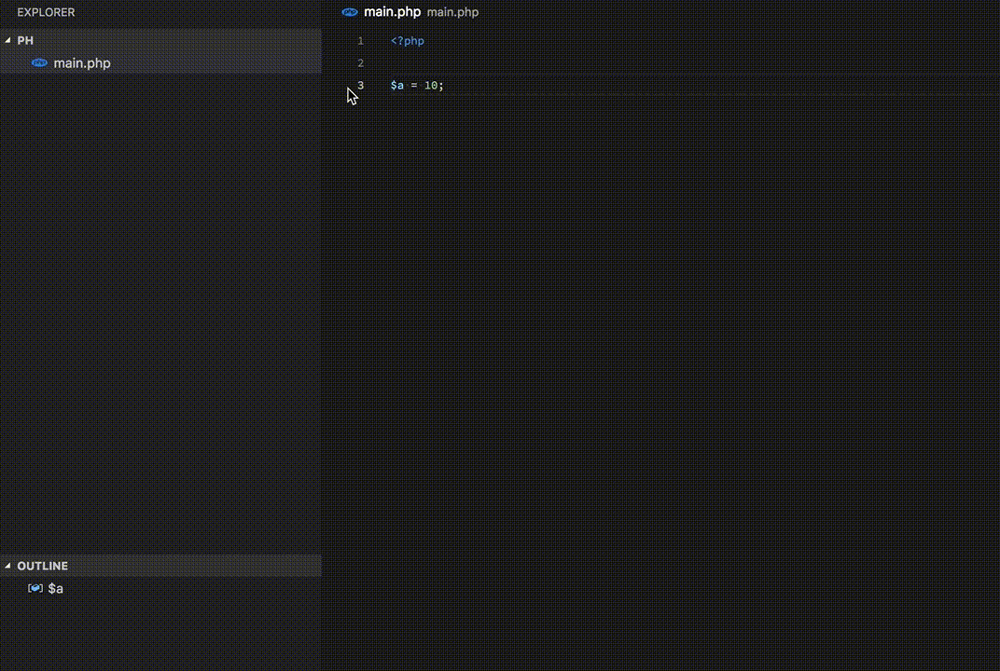

# VS Code PHP Xdebug

## About PHP Xdebug

## Using PHP Xdebug

- Install the **PHP Xdebug** extension in VS Code.
- Create a new 'program' file `*.php`.
- Switch to the debug viewlet and press the gear dropdown.
- Select the debug environment "PHP Xdebug".
